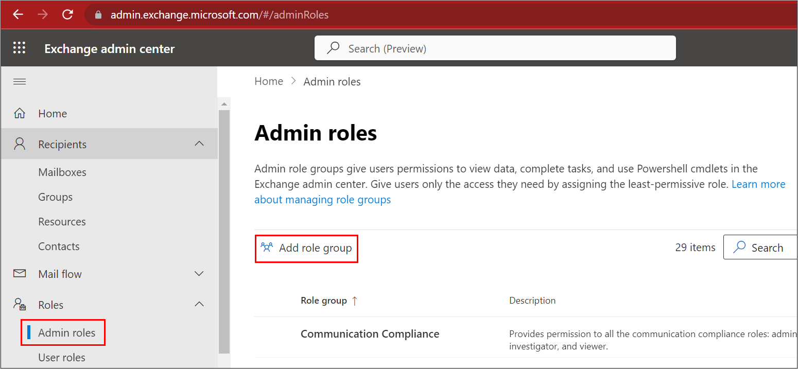
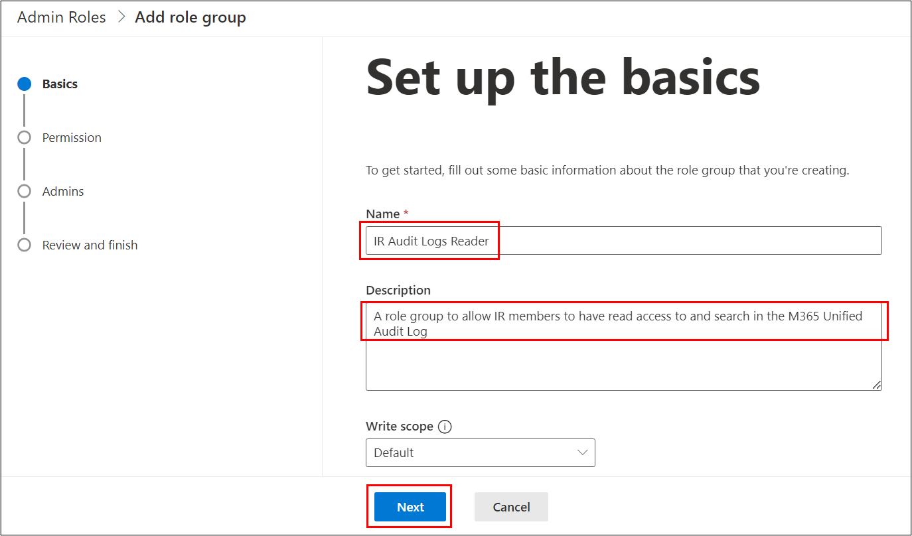
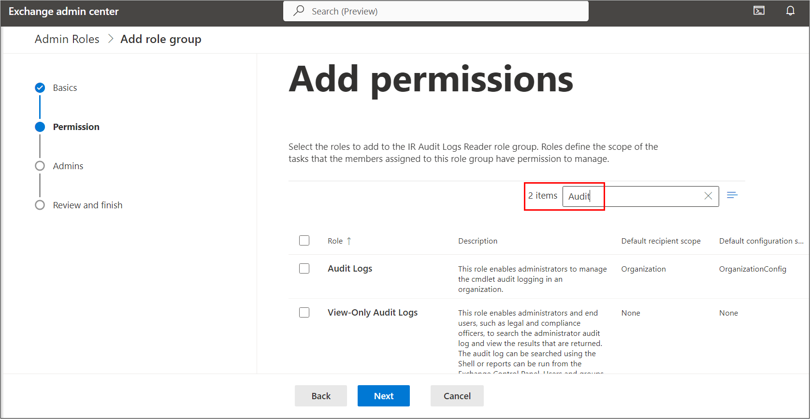
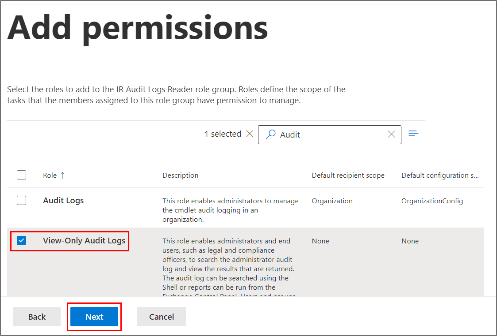
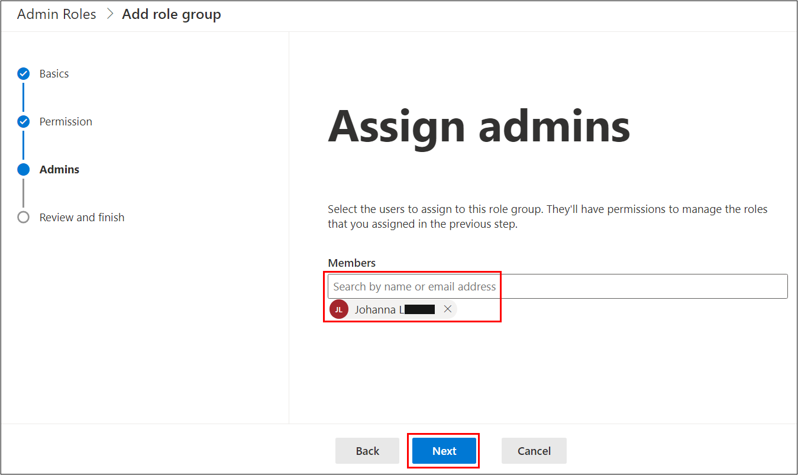
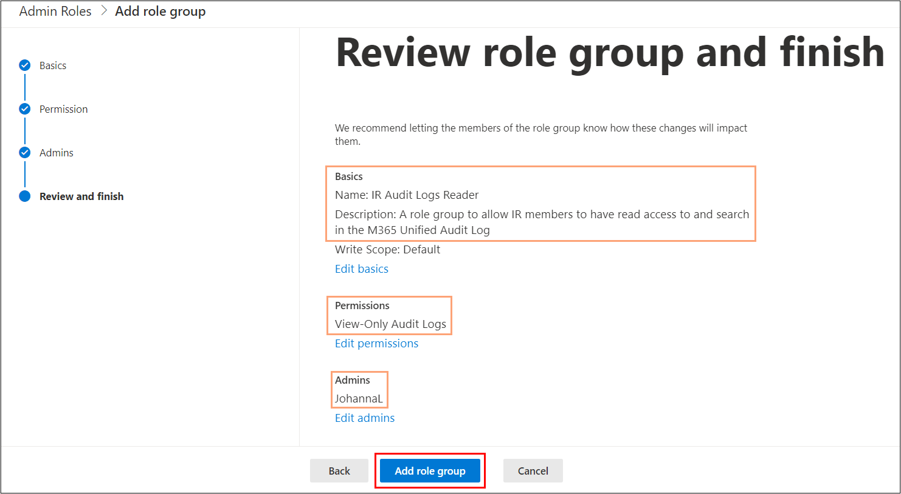
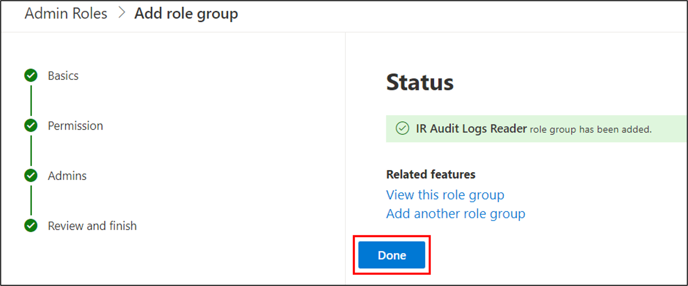
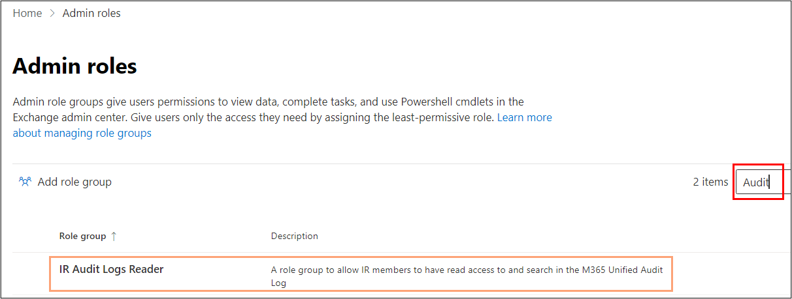
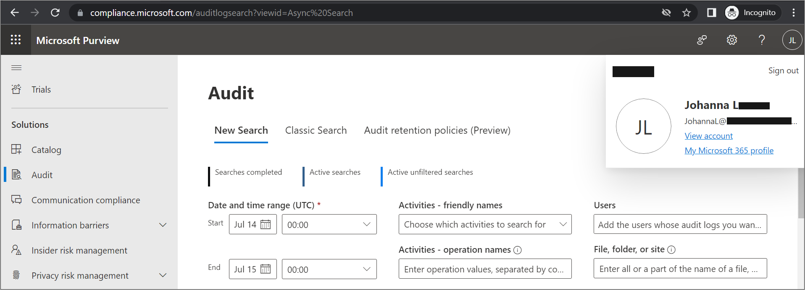

<h1>Scenario</h1> 
Suppose we need to give a member in our organization (Johanna L) access to search the Unified Audit Log (UAL) natively using Purview Audit within the Compliance Portal. Additionally, we need to make sure that the principle of least privilege has been followed to align with security best practices. How would we do this? Read on to find out!

<h2>Pitfalls to avoid</h2>
Even though there are "Audit Reader" roles in both Microsoft 365 Defender and Microsoft Purview Compliance, these will not give someone access to Purview Audit. The correct way detailed below is by assigning the permission within Exchange Online.

The [reason for this](https://learn.microsoft.com/en-us/microsoft-365/compliance/audit-log-search?view=o365-worldwide#before-you-search-the-audit-log) is because searching the audit log leverages Exchange Online PowerShell Cmdlets under the hood.

<h2>Pre-Requisites</h2>

You will need to have the [appropriate licensing](https://learn.microsoft.com/en-us/purview/audit-solutions-overview?view=o365-worldwide#licensing-requirements) & [Role Management RBAC role](https://learn.microsoft.com/en-us/exchange/permissions-exo/role-groups#what-do-you-need-to-know-before-you-begin) in Exchange Online before executing the below steps.

<h2>Steps</h2>

### Screenshot Key
| Colour of box | Meaning |
|:---|:---|
|Red | Red boxes indicate where to click and/or enter text |
|Orange | Orange boxes indicates reviewing the information entered |

1. **Navigate** to [Admin Roles within the Exchange Admin Center (EAC)](https://admin.exchange.microsoft.com/#/adminRoles) and Click Add Role Group which will start the wizard.

2. **Specify** a name and description for the role group. An example is provided below. Once satisfied, Click Next.

3. **Search** for "Audit" and you should see the two roles below.

4. **Tick** the "View-Only Audit Logs" option and Click Next.

5. **Type** in the user who should receive this permission. For our scenario, we will choose Johanna L as shown below. Once satisfied, Click Next.

6. **Review** the details you've provided in Steps 2-5. If there are any mistakes, go back and change them. If all is fine then click Create Role Group and wait a short while.

7. 
*    7a) **Verify** the Status shows the role group has been added. Once satisfied, click Done. 

* 7b) **Ensure** the newly created Role Group is available within EAC. This will be useful if we need to add more members in future. To do this, search for "Audit" in the Exchange Admin Center > Admin Roles page. As you can see, the screenshot below shows our role group is visible within the EAC Admin Roles page.

<h2>Validating Access</h2>

1.  **Navigate** to the [Purview Audit solution](https://compliance.microsoft.com/auditlogsearch) within the Compliance Portal and log in as the member who you gave permissions to. For our scenario, the member was Johanna L. If you've done everything correctly, the Audit page will be visible and clickable to said member as shown below.

<h2>Troubleshooting</h2>

* If the member sees a [greyed out page](images/1z.png) for Purview Audit then it means the permissions haven't been assigned correctly.
* To fix this, repeat the steps on this page ensuring everything is done correctly and this should resolve the issue.

<h2>References</h2>

[Assign permissions to search the audit log](https://learn.microsoft.com/en-us/microsoft-365/compliance/audit-standard-setup?view=o365-worldwide#step-2-assign-permissions-to-search-the-audit-log)
