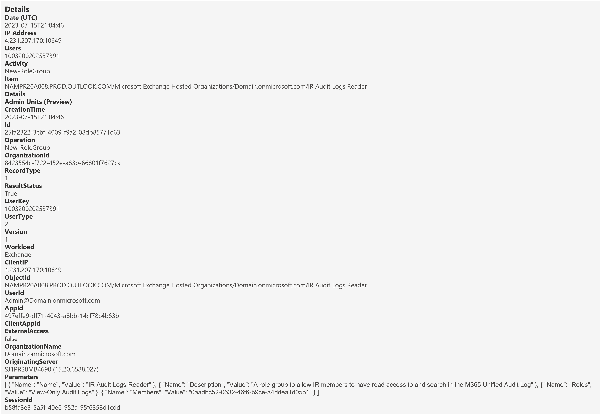
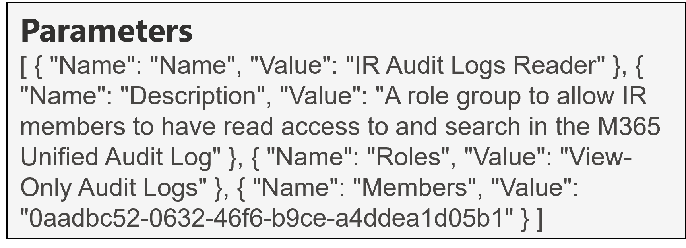
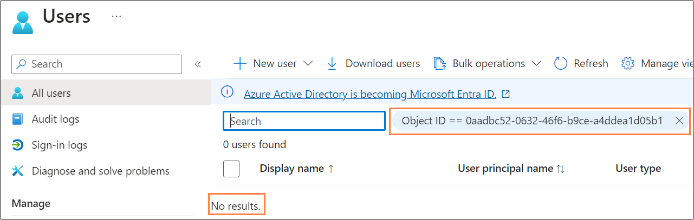
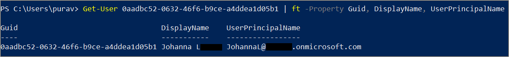

<h1> New-RoleGroup</h1>

This page will detail the New-RoleGroup operation audit event in terms of key fields of note and how to decipher them.

 **Table of contents:**
 - [Overview](#Overview)
 - [Key Fields of Note](#key-fields-of-note)
 - [Fields to decipher](#fields-to-decipher)
 - [Next Steps](#next-steps)

<h2>Overview</h2>

| Operation &nbsp;&nbsp;&nbsp;&nbsp;&nbsp;&nbsp;&nbsp;&nbsp;&nbsp;&nbsp;&nbsp;&nbsp;&nbsp;&nbsp;&nbsp;&nbsp;&nbsp;&nbsp;&nbsp;&nbsp;&nbsp;&nbsp;&nbsp;&nbsp;&nbsp;&nbsp;| RecordType | RecordType Name | Screenshot (Note: Some personal fields have been redacted) | Description &nbsp;&nbsp;&nbsp;&nbsp;&nbsp;&nbsp;&nbsp;&nbsp;&nbsp;&nbsp;&nbsp;&nbsp;&nbsp;&nbsp;&nbsp;&nbsp;&nbsp;&nbsp;&nbsp;&nbsp;&nbsp;&nbsp;&nbsp;&nbsp;&nbsp;&nbsp;&nbsp;&nbsp;&nbsp;&nbsp;&nbsp;&nbsp;&nbsp;&nbsp;&nbsp;&nbsp;&nbsp;&nbsp;&nbsp;&nbsp;&nbsp;&nbsp;&nbsp;&nbsp;&nbsp;&nbsp;&nbsp;&nbsp;&nbsp;&nbsp;&nbsp;&nbsp;&nbsp;&nbsp;&nbsp;&nbsp;&nbsp;&nbsp;&nbsp;&nbsp;&nbsp;|
|:---|:---|:---|:---|:---|
| New-RoleGroup | 1 | ExchangeAdmin |  | New-RoleGroup is an operation logged when a new Role Group is created in Exchange Online (EXO)|

> [!NOTE]  
> *The screenshot above shows the full audit record for this operation. Click on it to open a larger version in a new tab. Fields from this will be referenced throughout so follow along.*

<br> 

**Useful fields**:
| Field | Insight [(Source)](https://learn.microsoft.com/en-us/purview/audit-log-detailed-properties) |
|:---|:---|
| CreationTime | From this, we know that the EXO role group was created on "15th Jul 2023 at 9:04 PM UTC" |
| UserId | From this,  we know that the role group was created by "Admin@Domain(.)onmicrosoft.com" |
| ResultStatus | From this, we know that the role group was successfully created; value of "True" | 
| ClientIP | From this, we know that the action was performed from "4.231.207(.)170:10649". This is actually a Microsoft IP in Dublin, so in this case the IP of the service has been logged, not the IP of the device. | 

**Other useful fields**:
| Field &nbsp;&nbsp;&nbsp;&nbsp;&nbsp;&nbsp;&nbsp;&nbsp;&nbsp;&nbsp;&nbsp;&nbsp;&nbsp;&nbsp;&nbsp;&nbsp;&nbsp;&nbsp;&nbsp;&nbsp;&nbsp;&nbsp;&nbsp;&nbsp;&nbsp;&nbsp;&nbsp;&nbsp;&nbsp;&nbsp;&nbsp; | Insight |
|:---|:---|
| AppId | From this, we know that the Application ID of the application that performed this operation was "497effe9-df71-4043-a8bb-14cf78c4b63b". This resolves to [Exchange Admin Center (EAC)](https://learn.microsoft.com/en-us/troubleshoot/azure/active-directory/verify-first-party-apps-sign-in#application-ids-of-commonly-used-microsoft-applications) which makes sense as the action was performed in the EAC. |

<h2>Key fields of note</h2>

The Parameters object shown below contains a lot of useful information relating to this operation:
<p align="center">

</p>

| Field | Insight |
|:---|:---|
| Parameters.Name.Name | From this, we know the name of the newly created EXO Role Group was "IR Audit Logs Reader" |
| Parameters.Name.Description | From this, we know that the description of the EXO Role Group was "A role group to allow IR members to have read access to and search in the M365 Unified Audit Log" |
| Parameters.Name.Roles | From this, we know that the roles added to the EXO role group was "View-Only Audit Logs" | 
| Parameters.Name.Members | From this, we know that one member "0aadbc52-0632-46f6-b9ce-a4ddea1d05b1" was added to the EXO role group. **Who is this?** |

<h2>Fields to Decipher</h2> <a id="Overview"></a>

```Parameters.Name.Members``` - 0aadbc52-0632-46f6-b9ce-a4ddea1d05b1

> [!WARNING]
> Pitfall to Avoid

On first glance, you might think that the string "0aadbc52-0632-46f6-b9ce-a4ddea1d05b1" is an Object ID in Azure AD(AAD)/Microsoft Entra ID and perhaps we can simply search for this in AAD to find the user details.

However, upon trying this you get no results as shown below:

<p align="center">

</p>

> [!IMPORTANT]
> Deciphering Parameters.Name.Members

It turns out the value displayed in the Parameters.Name.Members property is actually the Globally Unique IDentifier (GUID) of the member's EXO Mailbox.

We can use [EXO PowerShell](https://learn.microsoft.com/en-us/powershell/exchange/connect-to-exchange-online-powershell) with the [appropriate permissions](https://learn.microsoft.com/en-us/exchange/view-only-recipients-role-exchange-2013-help) to resolve this by using the following command:

``` Get-User 0aadbc52-0632-46f6-b9ce-a4ddea1d05b1 | ft -Property Guid, DisplayName, UserPrincipalName ```

<p align="center">

</p>

This shows that the member added to the EXO role group was Johanna L.

> :mag_right:
> This makes perfect sense as the screenshot used for this example has been taken from the event when we gave access to Audit Log search to Johanna L in the [first part of this series](01-Access.md)*

<h2>Next Steps</h2>

Now that you've seen how to interpret the audit log record for when an EXO Role Group has been created, what can you do?
* If your UAL is being sent to a SIEM, perhaps you can look at creating a detection for when specific members are added to EXO Role Groups
* Set up a detection for when new role groups are created with specific EXO roles associated to them.
* If your company has a naming convention for EXO role groups, regularly review the logs for any new ones that don't adhere to this standard or have weird names as these could be set up by a threat actor. 
* Similarly look for any EXO role groups with weird descriptions.
