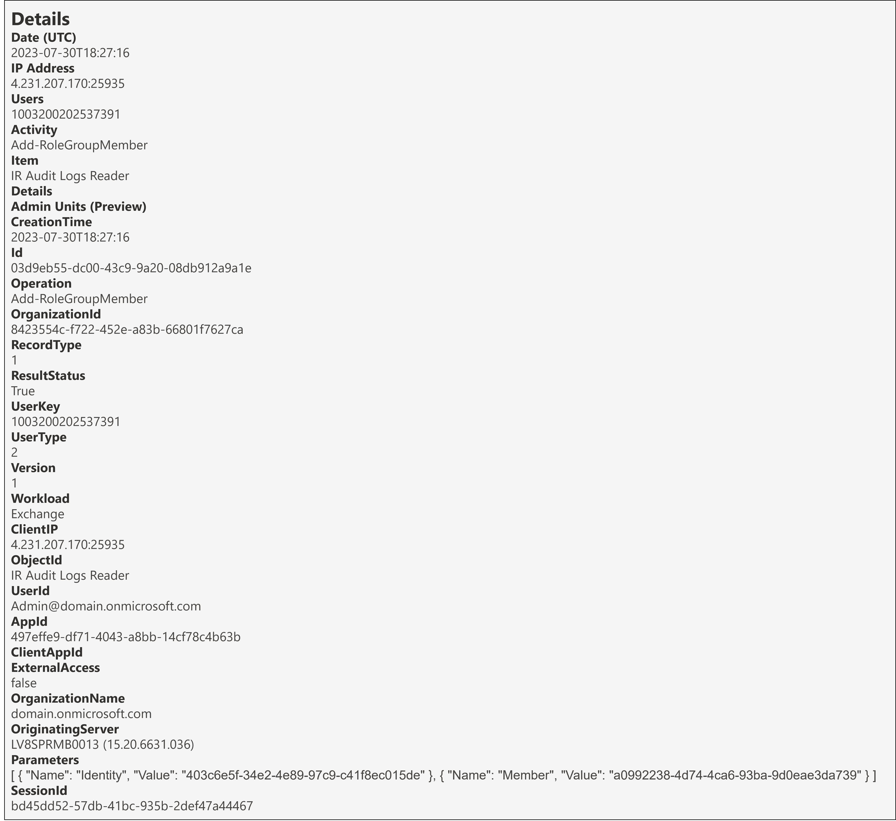
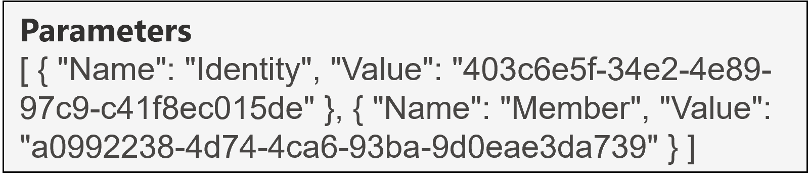
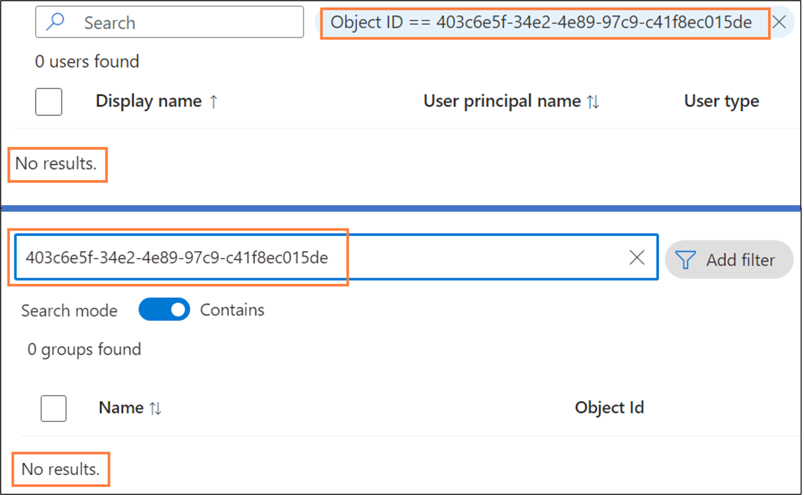
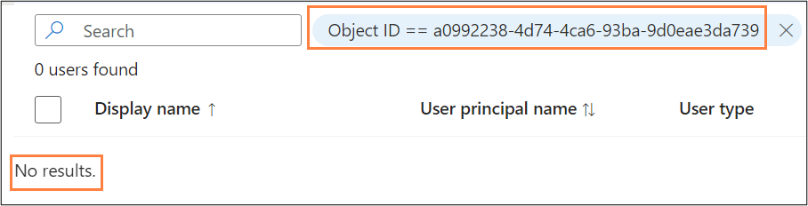
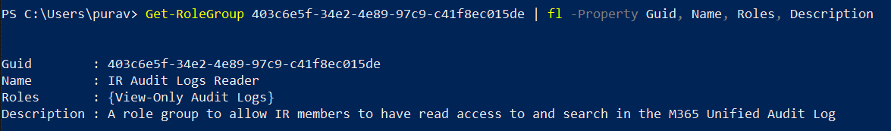
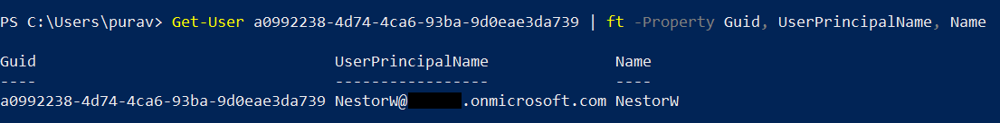

<h1>Add-RoleGroupMember</h1>

 **Table of contents:**
 - [Overview](#Overview)
 - [Useful fields](#useful-fields)
 - [Key Fields of Note](#key-fields-of-note)
 - [Fields to decipher](#fields-to-decipher)
 - [Next Steps](#next-steps)

<h2>Overview</h2>

<h3>Why it matters?</h3>
A threat actor can add a compromised user to an Exchange Online (EXO) role group as a method of achieving persistence. In this scenario, it's important to be able to understand exactly what has happened to answer questions like:

* Which role group was the user added to?
* Does this role group have any interesting roles assigned to it?

<br>

This page will help you investigate the audit event for the Add-RoleGroupMember operation from a DFIR perspective in terms of:
* Useful fields and the insight we can gain from them
* Key fields of note and if applicable, how to decipher them

<h3>Pre-Requisites</h3>

* Ensure you have access to the Audit Log following the guide in [01-Access](01-Access.md)
* [Search](images/3g.png) for the Add-RoleGroupMember operation, adjusting the date/time range and if applicable, including other relevant criteria to refine the search.

<br>

| Operation &nbsp;&nbsp;&nbsp;&nbsp;&nbsp;&nbsp;&nbsp;&nbsp;&nbsp;&nbsp;&nbsp;&nbsp;&nbsp;&nbsp;&nbsp;&nbsp;&nbsp;&nbsp;&nbsp;&nbsp;&nbsp;&nbsp;&nbsp;&nbsp;&nbsp;&nbsp;| RecordType | RecordType Name | Screenshot (Note: Some personal fields have been redacted) | Description &nbsp;&nbsp;&nbsp;&nbsp;&nbsp;&nbsp;&nbsp;&nbsp;&nbsp;&nbsp;&nbsp;&nbsp;&nbsp;&nbsp;&nbsp;&nbsp;&nbsp;&nbsp;&nbsp;&nbsp;&nbsp;&nbsp;&nbsp;&nbsp;&nbsp;&nbsp;&nbsp;&nbsp;&nbsp;&nbsp;&nbsp;&nbsp;&nbsp;&nbsp;&nbsp;&nbsp;&nbsp;&nbsp;&nbsp;&nbsp;&nbsp;&nbsp;&nbsp;&nbsp;&nbsp;&nbsp;&nbsp;&nbsp;&nbsp;&nbsp;&nbsp;&nbsp;&nbsp;&nbsp;&nbsp;&nbsp;&nbsp;&nbsp;&nbsp;&nbsp;&nbsp;|
|:---|:---|:---|:---|:---|
| Add-RoleGroupMember | 1 | ExchangeAdmin |  | Add-RoleGroupMember is an operation logged when a new member is added to an EXO Role Group. |

> [!NOTE]  
> *The screenshot above shows the full audit record for this operation. Click on it to open a larger version in a new tab. Fields from this will be referenced throughout so follow along.*

<br> 

<h2>Useful fields</h2>

| Field | Insight [(Source)](https://learn.microsoft.com/en-us/purview/audit-log-detailed-properties) |
|:---|:---|
| CreationTime | From this, we know that the user was added to the EXO Role group on "30th July 2023 at 6:27 PM UTC" |
| UserId | From this, we know that that the user was added to the role group by "Admin@Domain(.)onmicrosoft.com" |
| ResultStatus | From this, we know that the user was successfully added to the role group; value of "True" | 
| ClientIP | From this, we know that the action was performed from "4.231.207(.)170:25935". This is actually a Microsoft IP in Dublin, so in this case the IP of the service has been logged, not the IP of the device. | 

<h3>Other useful fields</h3>

| Field &nbsp;&nbsp;&nbsp;&nbsp;&nbsp;&nbsp;&nbsp;&nbsp;&nbsp;&nbsp;&nbsp;&nbsp;&nbsp;&nbsp;&nbsp;&nbsp;&nbsp;&nbsp;&nbsp;&nbsp;&nbsp;&nbsp;&nbsp;&nbsp;&nbsp;&nbsp;&nbsp;&nbsp;&nbsp;&nbsp;&nbsp; | Insight |
|:---|:---|
| AppId | From this, we know that the Application ID of the application that performed this operation was "497effe9-df71-4043-a8bb-14cf78c4b63b". This resolves to [Exchange Admin Center (EAC)](https://learn.microsoft.com/en-us/troubleshoot/azure/active-directory/verify-first-party-apps-sign-in#application-ids-of-commonly-used-microsoft-applications) which makes sense as the action was performed in the EAC. |

<h2>Key fields of note</h2>

The Parameters object shown below contains some useful information relating to this operation:
<p align="center">

</p>

| Field | Insight |
|:---|:---|
| Parameters.Name.Identity | This is hard to interpret, we can see the value is "403c6e5f-34e2-4e89-97c9-c41f8ec015de" but **What is this?** |
| Parameters.Name.Member| This is also hard to interpret, we can see the value is "a0992238-4d74-4ca6-93ba-9d0eae3da739" but **What is this?** |

<h2>Fields to Decipher</h2> <a id="Overview"></a>

1. ```Parameters.Name.Identity``` - 403c6e5f-34e2-4e89-97c9-c41f8ec015de
2. ```Parameters.Name.Member``` - a0992238-4d74-4ca6-93ba-9d0eae3da739

> [!WARNING]
> Pitfall to Avoid

Those of you that read [02-New-RoleGroup](02-New-RoleGroup.md) will remember that searching for a similar random string value in Microsoft Entra ID Users by Object ID didn't give any results, but is it any different here?

It's not clear whether the Parameters.Name.Identity value is for a user or a group so let's search both in Entra ID:

<p align="center">

</p>

No results for either, interesting. Well we can rightly assume that Parameters.Name.Member must tie back to a user in the tenant so how about if we search for this value in Entra ID Users by Object ID?

<p align="center">

</p>

Again, no results, alright let's actually decipher these values and see what they mean.

> [!IMPORTANT]
> 1. Deciphering Parameters.Name.Identity

It turns out the value displayed in the Parameters.Name.Identity property is actually the Globally Unique IDentifier (GUID) of the EXO Role Group.

We can use [EXO PowerShell](https://learn.microsoft.com/en-us/powershell/exchange/connect-to-exchange-online-powershell) with the [appropriate permissions](https://learn.microsoft.com/en-us/exchange/view-only-configuration-role-exchange-2013-help) to resolve this by using the following command:

``` Get-RoleGroup 403c6e5f-34e2-4e89-97c9-c41f8ec015de | fl -Property Guid, Name, Roles, Description ```

<p align="center">

</p>

This shows that the EXO Role Group that the user was added to is named "IR Audit Logs Reader" and additionally we can see metadata relating to this group including a description but more importantly the roles/permissions associated to this role group.

*Note: If you look at the screenshot of the audit event at the top of this page, you'll see that the value of the "Item" and "ObjectId" field is "IR Audit Logs Reader" which tells you the name of the EXO Role Group without deciphering so why does Microsoft hide this in the Parameters Object? Nobody knows!*

>[!IMPORTANT]
> 2. Deciphering Parameters.Name.Member

It turns out the value displayed in the Parameters.Name.Member property is actually the Globally Unique IDentifier (GUID) of the member's EXO Mailbox.

We can use [EXO PowerShell](https://learn.microsoft.com/en-us/powershell/exchange/connect-to-exchange-online-powershell) with the [appropriate permissions](https://learn.microsoft.com/en-us/exchange/view-only-recipients-role-exchange-2013-help) to resolve this by using the following command:

``` Get-User a0992238-4d74-4ca6-93ba-9d0eae3da739 | ft -Property Guid, UserPrincipalName, Name ```

<p align="center">

</p>

> :mag_right:
> Therefore we now know that NestorW was added to the "IR Audit Reader" EXO Role Group.

<h2>Next Steps</h2>

Now that you've seen how to interpret the audit log record for when a member has been added to an EXO role group, what can you do?

* Fortunately there are default alert policies for [this kind of activity](https://learn.microsoft.com/en-us/purview/alert-policies#permissions-alert-policies) and now you know how to decipher the audit event for the activity to better understand what has happened from a DFIR perspective.
* A screenshot of this default alert for our particular scenario can be found [here](images/3h.png).

If the UAL is being sent to a third party SIEM then consider these additional steps:
* Creating a custom alert for when specific members are added to EXO Role Groups
* Creating a custom alert for when members are added to EXO role groups with specific roles associated to them
