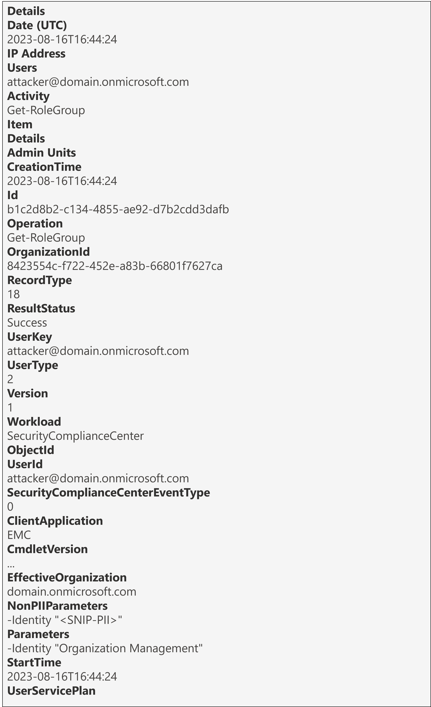
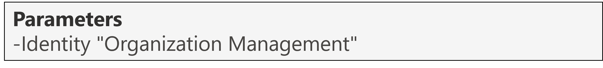

<h1>Get-RoleGroup</h1>

 **Table of contents:**
 - [Overview](#Overview)
 - [Useful fields](#useful-fields)
 - [Key Fields of Note](#key-fields-of-note)
 - [Fields to decipher](#fields-to-decipher)
 - [Next Steps](#next-steps)

<h2>Overview</h2>

<h3>Why it matters?</h3>

A threat actor may run an enumeration command to retrieve a list of [Microsoft Defender for Office (MDO) and Purview Compliance role groups](https://learn.microsoft.com/en-us/microsoft-365/security/office-365-security/scc-permissions?view=o365-worldwide#role-groups-in-microsoft-defender-for-office-365-and-microsoft-purview-compliance) as a method of [Discovery](https://attack.mitre.org/tactics/TA0007/) to better understand your environment. In this scenario, it's important to be able to understand exactly what has happened to answer questions like: 

* Did the enumeration command run successfully?
* If yes, did the attacker perform any further targeted enumeration?

 

This page will help you investigate the audit event for the Get-RoleGroup operation from a DFIR perspective in terms of:
* Useful fields and the insight we can gain from them
* Key fields of note and if applicable, how to decipher them

<h3>Pre-Requisites</h3>

* Ensure you have access to the Audit Log following the guide in [01-Access](01-Access.md)
* [Search](images/4a.png) for the Get-RoleGroup  operation, adjusting the date/time range and if applicable, including other relevant criteria to refine the search.

 

> [!IMPORTANT]  
> The Get-RoleGroup operation [isn't logged for ExchangeAdmin](https://learn.microsoft.com/en-us/purview/audit-log-activities#exchange-admin-activities), in other words if an attacker was to enumerate Exchange Online Role Groups, they would be undetected. *In fact, no Get-* Operations are logged for the ExchangeAdmin RecordType.*
> 
> **This is why the RecordType in the table below is SecurityComplianceCenterEOPCmdlet since enumeration attempts of MDO & Purview Compliance Role Groups are logged.**

| Operation &nbsp;&nbsp;&nbsp;&nbsp;&nbsp;&nbsp;&nbsp;&nbsp;&nbsp;&nbsp;&nbsp;&nbsp;&nbsp;&nbsp;&nbsp;&nbsp;&nbsp;&nbsp;&nbsp;&nbsp;&nbsp;&nbsp;&nbsp;&nbsp;&nbsp;&nbsp;| RecordType | RecordType Name | Screenshot (Note: Some personal fields have been redacted) | Description &nbsp;&nbsp;&nbsp;&nbsp;&nbsp;&nbsp;&nbsp;&nbsp;&nbsp;&nbsp;&nbsp;&nbsp;&nbsp;&nbsp;&nbsp;&nbsp;&nbsp;&nbsp;&nbsp;&nbsp;&nbsp;&nbsp;&nbsp;&nbsp;&nbsp;&nbsp;&nbsp;&nbsp;&nbsp;&nbsp;&nbsp;&nbsp;&nbsp;&nbsp;&nbsp;&nbsp;&nbsp;&nbsp;&nbsp;&nbsp;&nbsp;&nbsp;&nbsp;&nbsp;&nbsp;&nbsp;&nbsp;&nbsp;&nbsp;&nbsp;&nbsp;&nbsp;&nbsp;&nbsp;&nbsp;|
|:---|:---|:---|:---|:---|
| Get-RoleGroup | 18 | SecurityComplianceCenterEOPCmdlet |  | Get-RoleGroup is an operation logged when an admin runs a command to retrieve a list of MDO & Purview Compliance Role Groups. |

> [!NOTE]  
> *The screenshot above shows the full audit record for this operation. Click on it to open a larger version in a new tab. Fields from this will be referenced throughout so follow along.*

  

<h2>Useful fields</h2>

| Field | Insight [(Source)](https://learn.microsoft.com/en-us/purview/audit-log-detailed-properties) |
|:---|:---|
| CreationTime | From this, we know that the command was run on "16th August 2023 at 4:44 PM UTC" |
| UserId | From this, we know that that the user that ran the command was "attacker@domain(.)onmicrosoft.com" |
| ResultStatus | From this, we know that the command executed successfully; value of "True" | 

<h2>Key fields of note</h2>

The Parameters object shown below contains one piece of useful information relating to this operation:

| Field | Insight |
|:---|:---|
| Parameters | From this we can see that the command was run with a flag of "-Identity "eDiscoveryManager"" |

> [!IMPORTANT]
> This is important because the [Organization Management](https://learn.microsoft.com/en-us/microsoft-365/security/office-365-security/scc-permissions?view=o365-worldwide#:~:text=View%2DOnly%20Recipients-,Organization%20Management,-1) role group is highly privileged. It's a group that Global Admins are added to by default.
>
> Through this command an attacker could be able to better understand the config of this role group.

 

> [!NOTE]
> Note the audit event used in this example is a more targeted form of enumeration, in the first instance an attacker would run the command without any parameters and the audit event for that can be found [here](images/4d.png). As you can see, there are no parameters supplied.

<h2>Fields to Decipher</h2>

None 👌🏽

<h2>Next Steps</h2>

Now that you've seen how to interpret the audit log record for when MDO & Purview Compliance Role Groups are enumerated, what can you do?

* Monitor MDO & Purview Compliance Role Groups for any suspicious additions by looking for Audit events with [Add-RoleGroupMember](03-Add-RoleGroupMember.md).
  *This page shows the audit event within the ExchangeAdmin RecordType but similar steps could be followed for the SecurityComplianceCenterEOPCmdlet RecordType.*
  
* Monitor if an attacker is trying to retrieve members of these MDO & Purview Compliance Role Groups, we'll explore the audit event for this in the next part of this series.🚀
