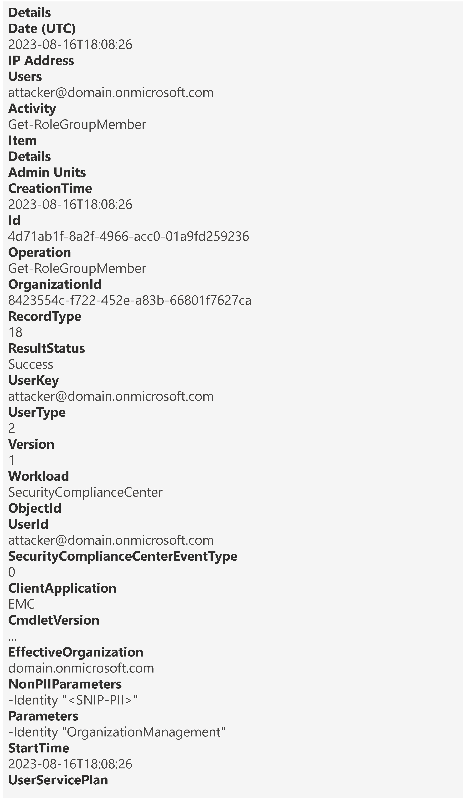
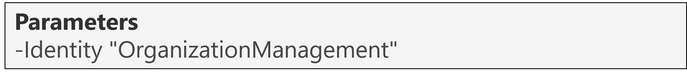

<h1>Get-RoleGroupMember</h1>

 **Table of contents:**
 - [Overview](#Overview)
 - [Useful fields](#useful-fields)
 - [Key Fields of Note](#key-fields-of-note)
 - [Fields to decipher](#fields-to-decipher)
 - [Next Steps](#next-steps)

<h2>Overview</h2>

<h3>Why it matters?</h3>

A threat actor may run an enumeration Command (Cmdlet) to retrieve the members of a [Microsoft Defender for Office (MDO) and Purview Compliance role group](https://learn.microsoft.com/en-us/microsoft-365/security/office-365-security/scc-permissions?view=o365-worldwide#role-groups-in-microsoft-defender-for-office-365-and-microsoft-purview-compliance) as a method of [Discovery](https://attack.mitre.org/tactics/TA0007/) to better understand your environment. In this scenario, it's important to be able to understand exactly what has happened to answer questions like: 

* Did the enumeration command run successfully?

 

This page will help you investigate the audit event for the Get-RoleGroupMember operation from a DFIR perspective in terms of:
* Useful fields and the insight we can gain from them
* Key fields of note and if applicable, how to decipher them

<h3>Pre-Requisites</h3>

* Ensure you have access to the Audit Log following the guide in [01-Access](01-Access.md)
* [Search](images/5a.png) for the Get-RoleGroupMember operation, adjusting the date/time range and if applicable, including other relevant criteria to refine the search.

 

> [!IMPORTANT]  
> Similar to the Get-RoleGroup operation we explored in the [previous part](04-Get-RoleGroup.md), the Get-RoleGroupMember operation [isn't logged for ExchangeAdmin](https://learn.microsoft.com/en-us/purview/audit-log-activities#exchange-admin-activities), in other words if an attacker was to enumerate members of an Exchange Online Role Group, they would be undetected. *In fact, no Get- Operations are logged for the ExchangeAdmin RecordType.*
> 
> **This is why the RecordType in the table below is SecurityComplianceCenterEOPCmdlet since enumeration attempts of members of a MDO & Purview Compliance Role Group are logged.**

| Operation &nbsp;&nbsp;&nbsp;&nbsp;&nbsp;&nbsp;&nbsp;&nbsp;&nbsp;&nbsp;&nbsp;&nbsp;&nbsp;&nbsp;&nbsp;&nbsp;&nbsp;&nbsp;&nbsp;&nbsp;&nbsp;&nbsp;&nbsp;&nbsp;&nbsp;&nbsp;| RecordType | RecordType Name | Screenshot (Note: Some personal fields have been redacted) | Description &nbsp;&nbsp;&nbsp;&nbsp;&nbsp;&nbsp;&nbsp;&nbsp;&nbsp;&nbsp;&nbsp;&nbsp;&nbsp;&nbsp;&nbsp;&nbsp;&nbsp;&nbsp;&nbsp;&nbsp;&nbsp;&nbsp;&nbsp;&nbsp;&nbsp;&nbsp;&nbsp;&nbsp;&nbsp;&nbsp;&nbsp;&nbsp;&nbsp;&nbsp;&nbsp;&nbsp;&nbsp;&nbsp;&nbsp;&nbsp;&nbsp;&nbsp;&nbsp;&nbsp;&nbsp;&nbsp;&nbsp;&nbsp;&nbsp;&nbsp;&nbsp;&nbsp;&nbsp;&nbsp;&nbsp;|
|:---|:---|:---|:---|:---|
| Get-RoleGroupMember | 18 | SecurityComplianceCenterEOPCmdlet |  | Get-RoleGroupMember is an operation logged when an admin runs a command to retrieve a list of members of a MDO & Purview Compliance Role Group. |

> [!NOTE]  
> *The screenshot above shows the full audit record for this operation. Click on it to open a larger version in a new tab. Fields from this will be referenced throughout so follow along.*

  

<h2>Useful fields</h2>

| Field | Insight [(Source)](https://learn.microsoft.com/en-us/purview/audit-log-detailed-properties) |
|:---|:---|
| CreationTime | From this, we know that the command was run on "16th August 2023 at 6:08 PM UTC" |
| UserId | From this, we know that that the user that ran the command was "attacker@domain(.)onmicrosoft.com" |
| ResultStatus | From this, we know that the command executed successfully; value of "True" | 

<h2>Key fields of note</h2>

The Parameters object shown below contains one piece of useful information relating to this operation:

| Field | Insight |
|:---|:---|
| Parameters | From this we can see that the Cmdlet was ran with a flag of "-Identity "OrganizationManagement"" |

> [!IMPORTANT]
> This is important because the [Organization Management](https://learn.microsoft.com/en-us/microsoft-365/security/office-365-security/scc-permissions?view=o365-worldwide#:~:text=View%2DOnly%20Recipients-,Organization%20Management,-1) role group is highly privileged. It's a group that Global Admins are added to by default.
>
> Through this Cmdlet an attacker could enumerate members of this highly privileged role group to potentially target them with phishing emails as a means of [privilege escalation](https://attack.mitre.org/tactics/TA0004/).

 

> [!NOTE]
> 1. Whenever an admin runs Get-RoleGroupMember, they are forced to provide an Identity (a valid name of a Role Group).
> 2. Supplying an invalid Identity would produce a PowerShell error that you can see [here](images/5d.png) and the audit event can be seen [here](images/5e.png). As you can see from the audit event screenshot, the ResultStatus gives a value of "Error".
> 4. Hence why this technique typically would be used after [Get-RoleGroup](04-Get-RoleGroup.md) has been ran first, i.e. once the potential attacker knows the names of the role groups, they can then run this Cmdlet to enumerate the members of any role groups of interest.

<h2>Fields to Decipher</h2>

None 👌🏽

<h2>Next Steps</h2>

Now that you've seen how to interpret the audit log record for when members of a MDO & Purview Compliance Role Group are enumerated, what can you do?

* Monitor the members of the role groups that have been enumerated as they're likely to be targeted by a potential attacker with phishing emails so that the attacker can escalate their privileges.
