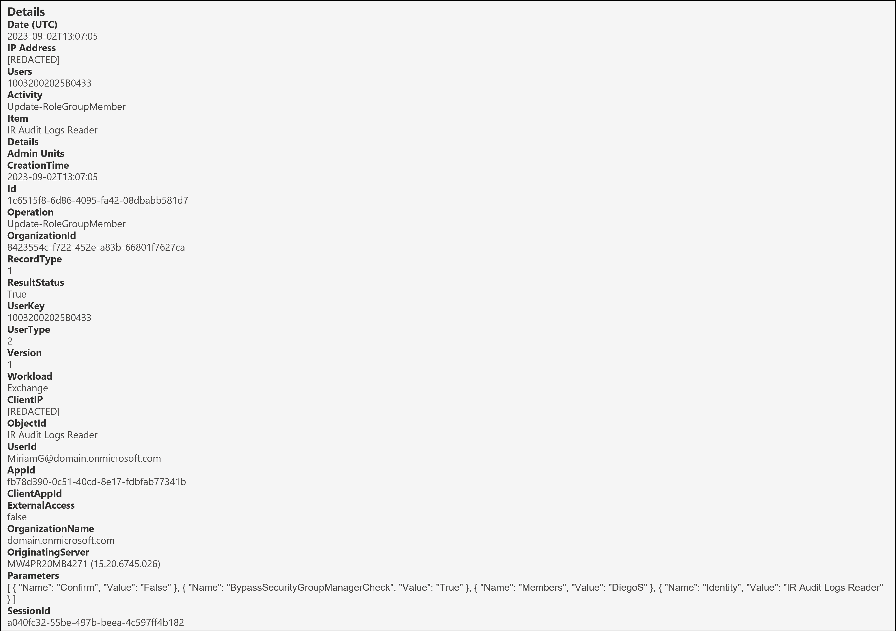
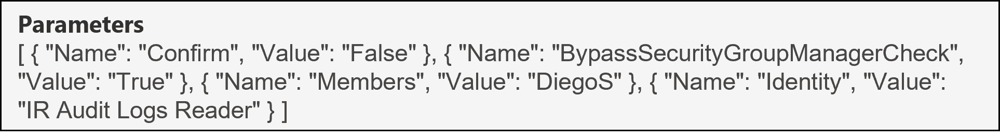

<h1>Update-RoleGroupMember</h1>

 **Table of contents:**
 - [Overview](#Overview)
 - [Useful fields](#useful-fields)
 - [Key Fields of Note](#key-fields-of-note)
 - [Fields to decipher](#fields-to-decipher)
 - [Next Steps](#next-steps)

<h2>Overview</h2>

<h3>Why it matters?</h3>

A threat actor can run a Command (Cmdlet) to replace the entire membership list of an Microsoft Defender for Office (MDO), Purview Compliance or Exchange Online (EXO) role group with an account they've compromised, or clear out this membership list completely as a method of [Impact](https://attack.mitre.org/tactics/TA0040/). This would cause a denial of service as it would remove role permissions from legitimate users. In this scenario, it's important to be able to understand exactly what has happened to answer questions like: 

* Which role group was impacted?
* Was the role group membership list cleared completely or replaced with an account instead?

 

This page will help you investigate the audit event for the Update-RoleGroupMember operation from a DFIR perspective in terms of:
* Useful fields and the insight we can gain from them
* Key fields of note and if applicable, how to decipher them

<h3>Pre-Requisites</h3>

* Ensure you have access to the Audit Log following the guide in [01-Access](01-Access.md)
* [Search](images/6a.png) for the Update-RoleGroupMember operation, adjusting the date/time range and if applicable, including other relevant criteria to refine the search.

 

| Operation &nbsp;&nbsp;&nbsp;&nbsp;&nbsp;&nbsp;&nbsp;&nbsp;&nbsp;&nbsp;&nbsp;&nbsp;&nbsp;&nbsp;&nbsp;&nbsp;&nbsp;&nbsp;&nbsp;&nbsp;&nbsp;&nbsp;&nbsp;&nbsp;&nbsp;&nbsp;| RecordType | RecordType Name | Screenshot (Note: Some personal fields have been redacted) | Description &nbsp;&nbsp;&nbsp;&nbsp;&nbsp;&nbsp;&nbsp;&nbsp;&nbsp;&nbsp;&nbsp;&nbsp;&nbsp;&nbsp;&nbsp;&nbsp;&nbsp;&nbsp;&nbsp;&nbsp;&nbsp;&nbsp;&nbsp;&nbsp;&nbsp;&nbsp;&nbsp;&nbsp;&nbsp;&nbsp;&nbsp;&nbsp;&nbsp;&nbsp;&nbsp;&nbsp;&nbsp;&nbsp;&nbsp;&nbsp;&nbsp;&nbsp;&nbsp;&nbsp;&nbsp;&nbsp;&nbsp;&nbsp;&nbsp;&nbsp;&nbsp;&nbsp;&nbsp;&nbsp;&nbsp;&nbsp;&nbsp;&nbsp;&nbsp;&nbsp;&nbsp;|
|:---|:---|:---|:---|:---|
| Update-RoleGroupMember | 1 | ExchangeAdmin |  | [Update-RoleGroupMember](https://learn.microsoft.com/en-us/powershell/module/exchange/update-rolegroupmember?view=exchange-ps) is an operation logged when an admin runs a command to modify the membership list of a MDO, EXO or Purview Compliance role group. |

> [!NOTE]  
> *The screenshot above shows the full audit record for this operation. Right click on it and open in a new tab to see a larger version. Fields from this will be referenced throughout so follow along.*

  

<h2>Useful fields</h2>

| Field | Insight [(Source)](https://learn.microsoft.com/en-us/purview/audit-log-detailed-properties) |
|:---|:---|
| CreationTime | From this, we know that the command was run on "2nd September 2023 at 1:07 PM UTC" |
| ObjectId | From this, we know that the role group impacted was "IR Audit Logs Reader" | 
| UserId | From this, we know that that the user that ran the command was "MiriamG@domain(.)onmicrosoft.com" |
| ResultStatus | From this, we know that the command executed successfully; value of "True" | 
| ClientIP | From this, we would know which IP address the command was ran from. In this case, it's been redacted.

<h3>Other useful fields</h3>

| Field &nbsp;&nbsp;&nbsp;&nbsp;&nbsp;&nbsp;&nbsp;&nbsp;&nbsp;&nbsp;&nbsp;&nbsp;&nbsp;&nbsp;&nbsp;&nbsp;&nbsp;&nbsp;&nbsp;&nbsp;&nbsp;&nbsp;&nbsp;&nbsp;&nbsp;&nbsp;&nbsp;&nbsp;&nbsp;&nbsp;&nbsp; | Insight |
|:---|:---|
| AppId | From this, we know that the Application ID of the application that performed this operation was "fb78d390-0c51-40cd-8e17-fdbfab77341b". This resolves to [Microsoft Exchange REST API Based Powershell](https://learn.microsoft.com/en-us/troubleshoot/azure/active-directory/verify-first-party-apps-sign-in#application-ids-of-commonly-used-microsoft-applications). This shows that Exchange Online PowerShell was used to run this command. |

<h2>Key fields of note</h2>

The Parameters object shown below contains useful information relating to this operation:

| Field | Insight |
|:---|:---|
| Parameters.Name.Confirm | From this we can see the command was ran with a hidden confirmation prompt; value of "False" |
| Parameters.Name.BypassSecurityGroupManagerCheck | From this we can see the command was run with a flag to override the security group management check, value of "True". More information on this field is in the "Important" section directly below. |
| Parameters.Name.Members | From this we can see that the user that replaced the previous membership list for this role group was "DiegoS" |
| Parameters.Name.Identity | From this, we get further confirmation that the role group impacted was "IR Audit Logs Reader" |

 

> [!IMPORTANT]
> Parameters.Name.BypassSecurityGroupManagerCheck doesn't apply for MDO and Purview Compliance role groups. This flag is only applicable for EXO Role Groups. The below points will help to better explain this parameter:
> 1. Every EXO Role Group has a "ManagedBy" property. This property specifies who can modify the membership of the role group and can be retrieved using EXO PowerShell. A screenshot showing the "ManagedBy" output for the "IR Audit Logs Reader" EXO role group can be found [here](images/6d.png). From this we know, the role group membership can only be modified by the "Organization Management" group and "MeganB". We've seen previously that typically only Global Admins are added to "Organization Management" and for this scenario, we have made sure MiriamG is not a global Admin.
> So how was MiriamG able to modify the membership successfully? Read on.
> 2. It's possible using EXO PowerShell to retrieve any EXO custom role groups that have the "Role Management" permission assigned and then use [Get-RoleGroupMember](05-Get-RoleGroupMember.md) to find out members of this role group. A screenshot showing the steps to achieve this with the output can be found [here](images/6e.png). From this we can see that there is an "EXO Role Management" role group with the "Role Management" role and that MiriamG is a member of this role group.
> 3. Any user with the "Role Management" role can, by default, update the membership for any EXO Role Groups that **don't** have the "ManagedBy" property populated. If the "ManagedBy" property is populated and the user with "Role Management" role isn't part of the "ManagedBy" property then the User would have to use the "BypassSecurityGroupManagerCheck" flag to update membership, otherwise it would fail. A screenshot showing this failure can be seen [here](images/6f.png) and a screenshot showing success when using the flag can be seen [here](images/6g.png).
> 4. It's important to stress that ONLY a user with the "Role Management" permission can use this bypass flag to update the membership of EXO groups that have the "ManagedBy" property populated.
> 5. As stated at the start, this Cmdlet can be used to replace the entire membership list so you might be wondering how did the membership look like prior to this change? A screenshot of this can be found [here](images/6h.png), note the time! In other words, there were five previous members in this role group who would have simultaneously lost their permissions as they were replaced with DiegoS.

 

> [!NOTE]
> As hinted at towards the start, the entire membership list could be cleared out by a threat actor as a more destructive technique. A screenshot showing the command to achieve this with the output can be found [here](images/6i.png). Note the "-Members $null" and the blank output of the Get-RoleGroupMember operation. The Audit event for this $null scenario would be the same as the one at the top of this page apart from the Parameters.Members field having a value of "" .

 

<h2>Fields to Decipher</h2>

None 👌🏽

<h2>Next Steps</h2>

Now that you've seen how to interpret the audit log record for when an entire membership list of an MDO, Purview Compliance & EXO Role Group is replaced by a compromised account, what can you do?

* Ensure you're regularly taking inventory of role groups with their memberships & ideally there should be a change/incident record for role group membership changes. This is so that if a scenario similar to this were to happen, it could be quickly remediated.
* Ensure that principle of least privilege is followed in that only users who have legitimate need to modify role group memberships have the "Role Management" role assigned.
