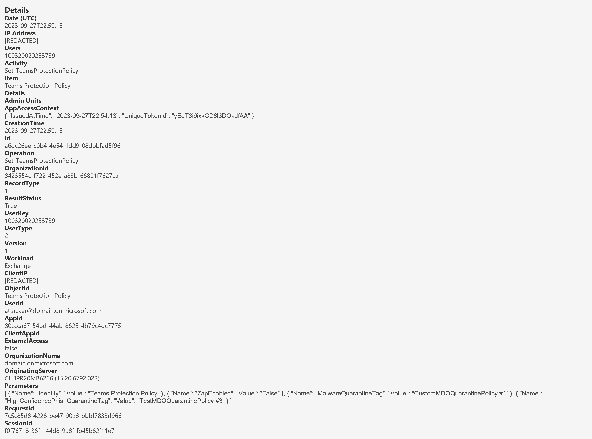
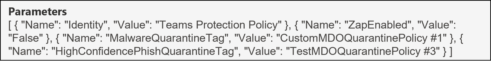
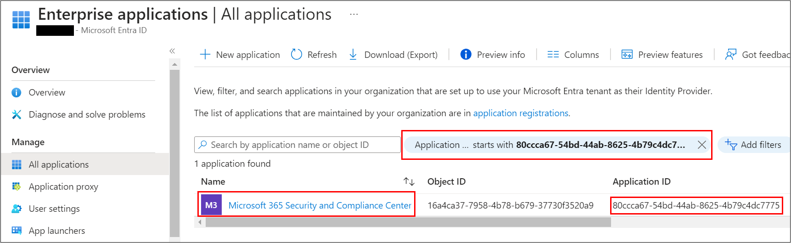

<h1>Set-TeamsProtectionPolicy</h1>

 **Table of contents:**
 - [Overview](#Overview)
 - [Useful fields](#useful-fields)
 - [Key Fields of Note](#key-fields-of-note)
 - [Fields to decipher](#fields-to-decipher)
 - [Next Steps](#next-steps)

<h2>Overview</h2>

<h3>Why it matters?</h3>

A threat actor could turn off Zero-hour auto purge (ZAP) for Microsoft Teams in Microsoft Defender for Office 365 (MDO) as a method of [Defense Evasion](https://attack.mitre.org/tactics/TA0040/). This way the security defenses would be impaired so that malicious messages sent to users by the threat actor in Teams Chats wouldn't be blocked. 

In this scenario, it's important to be able to understand exactly what has happened to answer questions like: 
* Was ZAP for Teams successfully turned off?
* If so, which user turned off ZAP for Teams and when was it done?

<br>

This page will help you investigate the audit event for the Set-TeamsProtectionPolicy operation from a DFIR perspective in terms of:
* Useful fields and the insight we can gain from them
* Key fields of note and if applicable, how to decipher them

<h3>Pre-Requisites</h3>

* Ensure you have access to the Audit Log following the guide in [01-Access](01-Access.md)
* [Search](images/7a.png) for the Set-TeamsProtectionPolicy operation, adjusting the date/time range and if applicable, including other relevant criteria to refine the search.

<br>

| Operation &nbsp;&nbsp;&nbsp;&nbsp;&nbsp;&nbsp;&nbsp;&nbsp;&nbsp;&nbsp;&nbsp;&nbsp;&nbsp;&nbsp;&nbsp;&nbsp;&nbsp;&nbsp;&nbsp;&nbsp;&nbsp;&nbsp;&nbsp;&nbsp;&nbsp;&nbsp;| RecordType | RecordType Name | Screenshot (Note: Some personal fields have been redacted) | Description &nbsp;&nbsp;&nbsp;&nbsp;&nbsp;&nbsp;&nbsp;&nbsp;&nbsp;&nbsp;&nbsp;&nbsp;&nbsp;&nbsp;&nbsp;&nbsp;&nbsp;&nbsp;&nbsp;&nbsp;&nbsp;&nbsp;&nbsp;&nbsp;&nbsp;&nbsp;&nbsp;&nbsp;&nbsp;&nbsp;&nbsp;&nbsp;&nbsp;&nbsp;&nbsp;&nbsp;&nbsp;&nbsp;&nbsp;&nbsp;&nbsp;&nbsp;&nbsp;&nbsp;&nbsp;&nbsp;&nbsp;&nbsp;&nbsp;&nbsp;&nbsp;&nbsp;&nbsp;&nbsp;&nbsp;&nbsp;&nbsp;&nbsp;&nbsp;&nbsp;&nbsp;|
|:---|:---|:---|:---|:---|
| Set-TeamsProtectionPolicy | 1 | ExchangeAdmin |  | [Set-TeamsProtectionPolicy](https://learn.microsoft.com/en-us/powershell/module/exchange/set-teamsprotectionpolicy?view=exchange-ps) is an operation logged when an admin modifies the Microsoft Teams protection policy. |

> [!NOTE]  
> *The screenshot above shows the full audit record for this operation. Right click on it and open in a new tab to see a larger version. Fields from this will be referenced throughout so follow along.*

<br> 

<h2>Useful fields</h2>

| Field | Insight [(Source)](https://learn.microsoft.com/en-us/purview/audit-log-detailed-properties) |
|:---|:---|
| CreationTime | From this, we know that the command was run on "27th September 2023 at 10:59 PM UTC"
| ResultStatus | From this, we know that the command executed successfully; value of "True" | 
| UserId | From this, we know that that the user that modified the policy was "attacker@domain(.)onmicrosoft.com" |
| ClientIP | From this, we would know which IP address the command was ran from. In this case, it's been redacted.

<h2>Key fields of note</h2>

The Parameters object shown below contains useful information relating to this operation:
<p align="center">

</p>

| Field | Insight |
|:---|:---|
| Parameters.Name.Identity | From this, we can see the object being modified is "Teams Protection Policy" |
| Parameters.Name.ZapEnabled | From this, we can see that ZAP was disabled, value of "False" |
| Parameters.Name.MalwareQuarantineTag | From this, we can see that the quarantine policy that's used for messages that are quarantined as malware by ZAP for Teams is called "CustomMDOQuarantinePolicy #1". More on this property can be found [here](https://learn.microsoft.com/en-us/powershell/module/exchange/set-teamsprotectionpolicy?view=exchange-ps#-malwarequarantinetag) |
| Parameters.Name.HighConfidencePhishTag | From this, we can see that the quarantine policy that's used for messages that are quarantined as high confidence phishing by ZAP for Teams is called "TestMDOQuarantinePolicy #3". More on this property can be found [here](https://learn.microsoft.com/en-us/powershell/module/exchange/set-teamsprotectionpolicy?view=exchange-ps#-highconfidencephishquarantinetag)|

<br>

<h2>Fields to Decipher</h2>

```AppId``` - 80ccca67-54bd-44ab-8625-4b79c4dc7775

Remember we have seen the field AppId in previous parts, most recently in [06-Update-RoleGroupMember](06-Update-RoleGroupMember.md). We learnt that this stands for Application ID and the [Verify first-party Microsoft applications in sign-in reports](https://learn.microsoft.com/en-us/troubleshoot/azure/active-directory/verify-first-party-apps-sign-in) docs page provides meaningful names for some of these App Id's.

However, if we search the string "80ccca67-54bd-44ab-8625-4b79c4dc7775" on this docs page, it's not present at all currently.

> [!IMPORTANT]
> Deciphering AppId

Since we know it's an Application ID, it's wise to assume that perhaps searching the string in Entra ID's "Enterprise Applications" section could help. Doing this we get the below output:

<p align="center">

</p>

Therefore we know that the Application that was used to make this change is "Microsoft 365 Security and Compliance Center" which is technically now called Microsoft 365 Defender.

> :mag_right:
> This makes perfect sense as this scenario was created by manipulating the Teams protection Policy through Microsoft Defender for Office settings, but if it were to have been done using Exchange Online PowerShell then the AppId would be different.


> [!NOTE]
> Editor's Note: I have raised this [Pull Request](https://github.com/MicrosoftDocs/SupportArticles-docs/pull/1278) to get this AppId updated in the Microsoft Docs page

<h2>Next Steps</h2>

Now that you've seen how to interpret the audit log record for when ZAP for Teams is switched off by a possible attacker, what can you do?

* Set up a detection for when ZAP for Teams is disabled and act quickly to negate the change.
