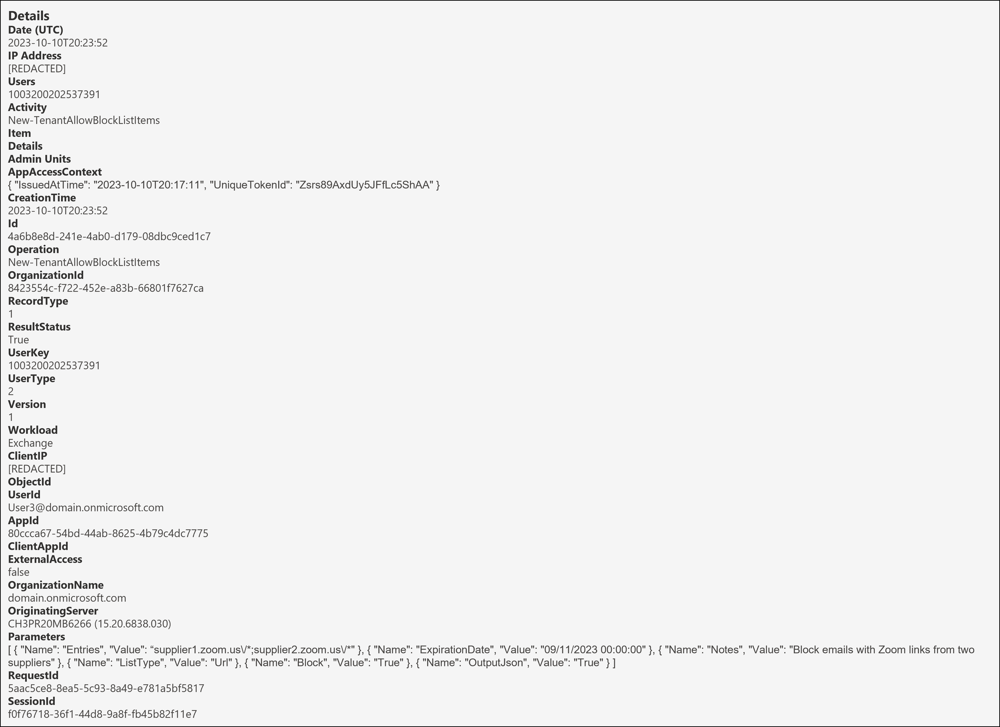
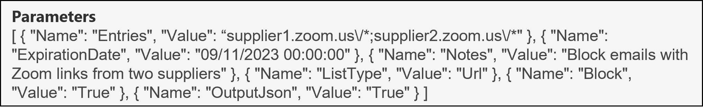

<h1>New-TenantAllowBlockListItems</h1>

 **Table of contents:**
 - [Overview](#Overview)
 - [Useful fields](#useful-fields)
 - [Key Fields of Note](#key-fields-of-note)
 - [Fields to decipher](#fields-to-decipher)
 - [Next Steps](#next-steps)

<h2>Overview</h2>

<h3>Why it matters?</h3>

An insider threat could prevent emails with business critical URL's from reaching the organization as a method of [Impact](http://attack.mitre.org/tactics/TA0040/). Examples of such URL's could be Teams Meeting URL's or Supplier vanity URL's used by Zoom. This would be achieved by adding those URL's to the [Tenant Allow/Block List (TABL) in Microsoft Defender for Office 365 (MDO)](https://learn.microsoft.com/en-us/microsoft-365/security/office-365-security/tenant-allow-block-list-urls-configure?view=o365-worldwide) with a Block action.

In this scenario, it's important to be able to understand exactly what has happened to answer questions like: 
* Which URL was added to the block list and was it successful?
* Who added the URL and when?
* When is the block set to expire and are there are any notes about this addition?

 

This page will help you investigate the audit event for the New-TenantAllowBlockListItems operation from a DFIR perspective in terms of:
* Useful fields and the insight we can gain from them
* Key fields of note and if applicable, how to decipher them

<h3>Pre-Requisites</h3>

* Ensure you have access to the Audit Log following the guide in [01-Access](01-Access.md)
* [Search](images/8a.png) for the New-TenantAllowBlockListItems operation, adjusting the date/time range and if applicable, including other relevant criteria to refine the search.

 

| Operation &nbsp;&nbsp;&nbsp;&nbsp;&nbsp;&nbsp;&nbsp;&nbsp;&nbsp;&nbsp;&nbsp;&nbsp;&nbsp;&nbsp;&nbsp;&nbsp;&nbsp;&nbsp;&nbsp;&nbsp;&nbsp;&nbsp;&nbsp;&nbsp;&nbsp;&nbsp;| RecordType | RecordType Name | Screenshot (Note: Some personal fields have been redacted) | Description &nbsp;&nbsp;&nbsp;&nbsp;&nbsp;&nbsp;&nbsp;&nbsp;&nbsp;&nbsp;&nbsp;&nbsp;&nbsp;&nbsp;&nbsp;&nbsp;&nbsp;&nbsp;&nbsp;&nbsp;&nbsp;&nbsp;&nbsp;&nbsp;&nbsp;&nbsp;&nbsp;&nbsp;&nbsp;&nbsp;&nbsp;&nbsp;&nbsp;&nbsp;&nbsp;&nbsp;&nbsp;&nbsp;&nbsp;&nbsp;&nbsp;&nbsp;&nbsp;&nbsp;&nbsp;&nbsp;&nbsp;&nbsp;&nbsp;&nbsp;&nbsp;&nbsp;&nbsp;&nbsp;&nbsp;&nbsp;&nbsp;&nbsp;&nbsp;&nbsp;&nbsp;|
|:---|:---|:---|:---|:---|
| New-TenantAllowBlockListItems | 1 | ExchangeAdmin |  | [New-TenantAllowBlockListItems](https://learn.microsoft.com/en-us/powershell/module/exchange/New-TenantAllowBlockListItems?view=exchange-ps) is an operation logged when an admin adds entries to the Tenant Allow/Block List in the Microsoft 365 Defender portal. |

> [!NOTE]  
> *The screenshot above shows the full audit record for this operation. Right click on it and open in a new tab to see a larger version. Fields from this will be referenced throughout so follow along.*

  

<h2>Useful fields</h2>

| Field | Insight [(Source)](https://learn.microsoft.com/en-us/purview/audit-log-detailed-properties) |
|:---|:---|
| CreationTime | From this, we know that the command was ran on "10th October 2023 at 8:23 PM UTC"
| ResultStatus | From this, we know that the command executed successfully; value of "True" | 
| UserId | From this, we know that that the user that added the URL to the TABL was "User3@domain(.)onmicrosoft.com" |
| ClientIP | From this, we would know which IP address the command was ran from. In this case, it's been redacted. |

<h3>Other useful fields</h3>

| Field &nbsp;&nbsp;&nbsp;&nbsp;&nbsp;&nbsp;&nbsp;&nbsp;&nbsp;&nbsp;&nbsp;&nbsp;&nbsp;&nbsp;&nbsp;&nbsp;&nbsp;&nbsp;&nbsp;&nbsp;&nbsp;&nbsp;&nbsp;&nbsp;&nbsp;&nbsp;&nbsp;&nbsp;&nbsp;&nbsp;&nbsp; | Insight |
|:---|:---|
| AppId | As we learnt from [07-Set-TeamsProtectionPolicy](07-Set-TeamsProtectionPolicy.md#fields-to-decipher) , an AppId of "80ccca67-54bd-44ab-8625-4b79c4dc7775" resolves to Microsoft 365 Defender. |

> [!NOTE]
> Editor's Note: At time of writing, my [Pull Request](https://github.com/MicrosoftDocs/SupportArticles-docs/pull/1278) is still waiting for approval to get this AppId updated in the Microsoft Docs page.

<h2>Key fields of note</h2>

The Parameters object shown below contains useful information relating to this operation:

| Field | Insight |
|:---|:---|
| Parameters.Name.Entries | From this, we know the URL's added were "supplier1.zoom.us\/\*;supplier2.zoom.us\/\*" and as you might notice, these URL's have [wildcards](https://learn.microsoft.com/en-us/microsoft-365/security/office-365-security/tenant-allow-block-list-urls-configure?view=o365-worldwide#url-syntax-for-the-tenant-allowblock-list) which means any emails with Zoom invites from Supplier1 or Supplier2 would be blocked from delivering |
| Parameters.Name.ExpirationDate | From this, we can see that the block entry has been set to expire on "9th November 2023 00:00 AM UTC". This aligns to the default 30 days expiry setting for new TABL entries |
| Parameters.Name.Notes | From this, we can see that the block was added with a note of "Block emails with Zoom links from two suppliers". |
| Parameters.Name.ListType | From this, we know that a "Url" was added. More on this property can be found at [ListType](https://learn.microsoft.com/en-us/powershell/module/exchange/New-TenantAllowBlockListItems?view=exchange-ps#-listtype) |
| Parameters.Name.Block | From this, we know that a Block action was set for this URL once added, value of "True" |

 

<h2>Fields to Decipher</h2>

None 👌🏽

<h2>Next Steps</h2>

Now that you've seen how to interpret the audit log record for when a new entry is added to the TABL, what can you do?

* Set up a detection rule for new entries being added to the TABL.
  - This could be further tuned to look for specific business critical URL's being added
* Check [MDO Quarantine](https://security.microsoft.com/quarantine?viewid=Email) to identify emails blocked due to entries in TABL and then release/delete accordingly.
  - Filtering on "Quarantine Reason: High Confidence Phish" and/or "Policy type:Anti-spam policy* might help to reduce the results to go through.
  - Clicking an entry in the Quarantine will bring up a side panel and in this, there's a property called "Blocked by organization policy : Tenant Allow/Block List URL blocked". If Microsoft is reading, it would be ideal if we could filter on this property in the overall Quarantine email section since this seems to be the best way to identify emails quarantined due to TABL entries.
 
> :rocket:
> Stay tuned for Parts 9 and 10 where we'll explore the audit events of TABL entries being modified and removed respectively.
